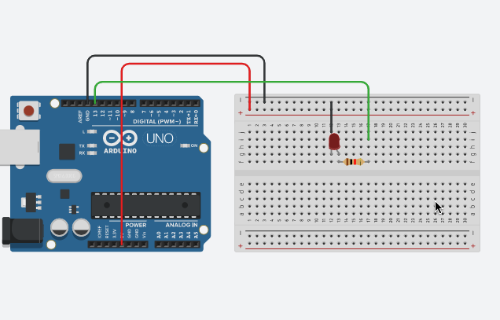

# Traffic light with Arduino

```.c
void setup()
{
  pinMode(13, OUTPUT);
}

void loop()
{
  digitalWrite(13, HIGH);
  delay(1000); // Wait for 1000 millisecond(s)
  digitalWrite(13, LOW);
  delay(1000); // Wait for 1000 millisecond(s)
}

```

The image of the circuit is shown in Fig. 1


